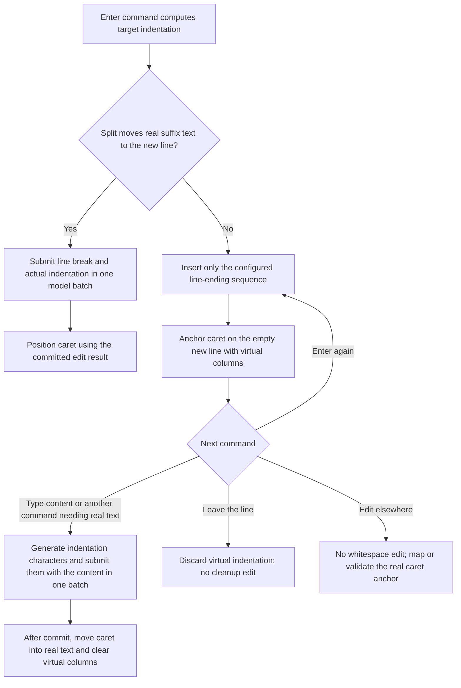

# Auto-whitespace: view-managed virtual indentation (future work)

Decision: automatic indentation on an empty new line is virtual caret state owned by `ITextView`. It is not text stored in either `PlainTextModel` or `TextModel`. This replaces the legacy implementation utilizing a shared document cleanup service built-in to `TextModel`. There are no cleanup candidates, shared or per-view, and no insert-then-trim lifecycle for newly generated indentation.

### Model and view state

The model stores only actual characters. Each view owns its carets, selections, virtual indentation, and logical/display-line mapping. A possible caret representation is:

```csharp
// Illustrative view state; not a finalized public API.
public readonly record struct ViewCaret(
    TextPosition Position, // Real logical position, at line end when virtual.
    int VirtualColumns);  // Nonnegative visual columns beyond that position.
```

Virtual columns are visual distance, not UTF-16 offsets or a stored string of spaces. They must never be passed to model APIs as out-of-range logical columns. A view may derive a virtual-whitespace rendering indicator from its carets; the text model layer does not have a virtual-whitespace line property. Virtual whitespaces are purely view layer states. Spaces are not written to the underlying text buffer, and the text model layer is not aware of the states.

Two views can show different virtual caret positions over the same empty model line. Moving one view's caret does not require changing another view or editing the document. Shared settings or indentation computation may live above views.

### Enter and typing flow



Compute indentation using the command/language policy, `IndentSize`, `TabSize`, and `InsertSpaces`. Materializing a target visual column may require tabs, spaces, or a combination, taking the real prefix's column into account. Read the current settings at materialization; whether setting changes preserve the old target column or recompute it remains a view policy choice.

At line end, Enter inserts only a line break. At a split with real suffix content, indentation before the suffix is actual text immediately; insert it with the line break in the same batch. The existing suffix remains document text. Splits involving only pre-existing whitespace need an explicit command policy; do not silently delete or virtualize stored whitespace.

Example, with LF and a four-space target column:

| Action                                      | Stored text           | View state                                              |
| ------------------------------------------- | --------------------- | ------------------------------------------------------- |
| Start at end of `if (...) {`                | `"if (...) {"`        | Real caret                                              |
| Enter                                       | `"if (...) {\n"`      | Caret on line 1, logical column 0, four virtual columns |
| Leave the line                              | Unchanged             | Virtual indentation discarded                           |
| Alternatively, type `x` while still virtual | `"if (...) {\n    x"` | Real caret after `x`; virtual columns cleared           |

### Command behavior

| Command or operation                        | Intended behavior / policy boundary                                                                                                                             |
| ------------------------------------------- | --------------------------------------------------------------------------------------------------------------------------------------------------------------- |
| Non-whitespace typing                       | Materialize required indentation and typed text in one model edit batch.                                                                                        |
| Space or Tab while virtual                  | Prefer materializing the virtual whitespaces; exact behavior is a view command policy to finalize.                                                              |
| Backspace while virtual                     | Reduce virtual indentation without modifying the model. Character-column versus indent-stop movement remains a command policy.                                  |
| Enter on an empty virtual line              | Insert the next line break without materializing indentation on the abandoned line; compute the new line's virtual target.                                      |
| Move the caret away                         | Drop that caret's virtual state; no model mutation.                                                                                                             |
| Unrelated document edit                     | Do not materialize or delete indentation. Map the real anchor through transitions; preserve the virtual target if the line is still suitable.                   |
| Edit that changes/removes the anchored line | Clear or recompute virtual state after validating the mapped anchor. Do not overwrite external content.                                                         |
| Save, search, ordinary copy, tokenization   | Observe real model text only. Virtual indentation is absent. Rectangular-copy semantics are separate future work.                                               |
| Paste, snippets, selection replacement      | The command determines whether indentation is required and submits explicit text. Do not base every decision solely on whether a typed character is whitespace. |
| IME (deferred)                              | The view may compose committed model text and pending IME text for rendering. Composition/cancellation and indentation commit timing will be designed later.    |

If whitespace visualization is enabled, any indication of virtual space must remain a view-only rendering choice and must not imply that actual spaces exist in the model. Rendering, hit testing, selection painting, and rectangular selection need explicit virtual-space rules when `ITextView` is designed.

### History, events, and multiple carets

Enter is one model edit; later indentation materialization plus content is another. With current per-edit history, undoing typing restores the empty line without indentation, and undoing Enter removes the line break. Virtual caret movement alone creates no model record or content event. Returning to the former virtual column on undo requires view/application selection checkpoints; snapshots do not encode that intent.

For multi-cursor input, resolve overlapping selections or coincident insertions before submission. Materialize each caret's needed indentation alongside its content in the same command batch and use input-correlated result ranges to position carets. Do not collapse distinct edit boundaries automatically.

Views consume immutable model transitions to map real anchors through external edits, undo, redo, and jumps. Command-specific selection intent and virtual-column checkpoints remain outside history records.

### Completed model removal and future implementation

`TrimAutoWhitespace`, `IsAutowhitespaceEdit`, pending line indices, candidate capture/computation, cursor-proximity checks, and appended cleanup deletions are removed from the text model layer. 

`TabSize`, `IndentSize`, `InsertSpaces`, and `DefaultEOL` are also removed from the text model; their future owner is the view/app command layer. The model applies explicit replacements and exposes committed transitions and per-input result ranges. It neither generates indentation nor trims unused indentation.